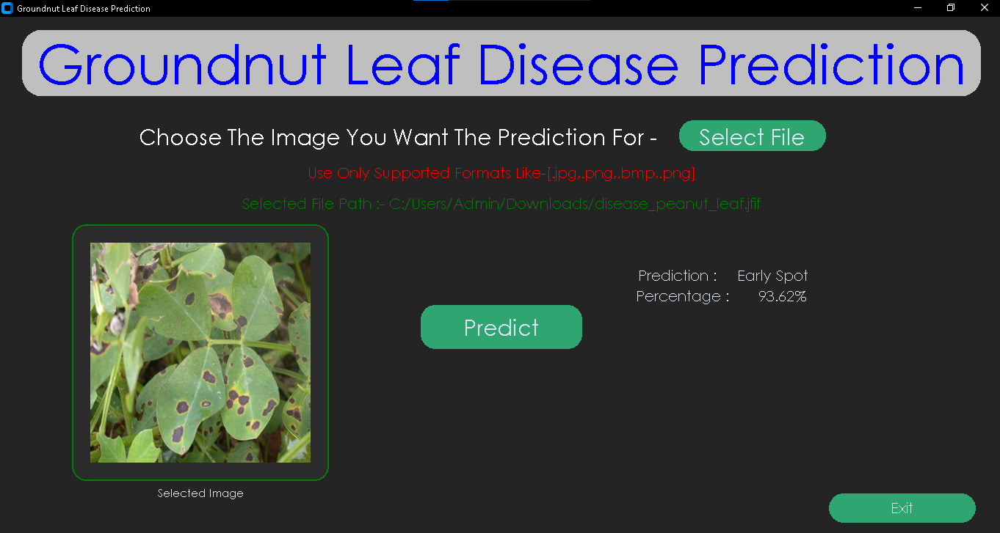

# Peanut Leaf Disease Detection using CNN


This project implements a Convolutional Neural Network (CNN) machine learning model to detect diseases in peanut plant leaves.

## Table of Contents

1. [Data Preparation](#data-preparation)
2. [Model Training](#model-training)
3. [Model Testing](#model-testing)
4. [GUI Usage](#gui-usage)

## Data Preparation

1. Acquire a dataset for training the model.
2. Organize the data into appropriate directories.
3. Clean and pre-process the data as necessary.

## Model Training

1. Install the required dependencies:
```bash
pip install -r requirements.txt
```
2. Follow the instructions in the `train.ipynb` file step by step to train the model.

## Model Testing

1. To test the performance of the trained model, run the `test.py` file:
```bash
python test.py
```
Note: Make sure to specify the image path in the `test.py` file before running.

## GUI Usage

1. Ensure that the trained model is present in the `model` directory.
2. Test the model using the steps in the [Model Testing](#model-testing) section before running the GUI.
3. Launch the GUI application:
```bash
python gui.py
```

## Requirements

All necessary dependencies are listed in the `requirements.txt` file. Install them using the command provided in the [Model Training](#model-training) section.

## Contributing

Contributions to improve the model or extend its functionality are welcome. Please feel free to submit pull requests or open issues for any bugs or feature requests.

## License
This project is licensed under the MIT License. See the [LICENSE](LICENSE) file for details.